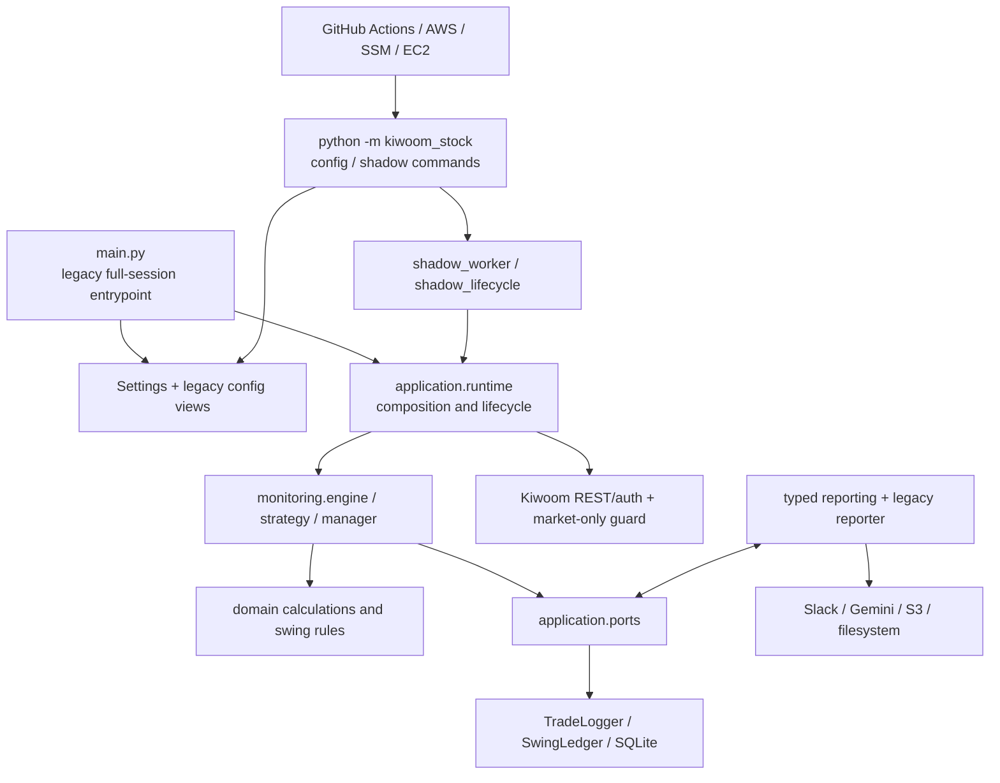

# 프로젝트 전체 리팩토링 사전 분석 보고서

> 상태: 구현 전 분석 완료 — 이 문서는 리팩토링 코드를 적용하지 않는다.
> 기준일: 2026-08-17 (Asia/Seoul)
> 기준 commit: `4304accd625619330095c7e447d7351ae84c805c`
> 운영 전제: shadow-only / no-live-trading

## 문서 목적과 판정 기준

이 문서는 현재 저장소의 구조적 문제, 기술 부채, 보존해야 할 계약,
리팩토링 우선순위와 검증 방법을 구현 전에 고정한다. 문제의 우선순위는 코드
미관이 아니라 장애 가능성, 변경 빈도, 영향 범위, 테스트 가능성, 개발 생산성,
구현 비용과 회귀 위험으로 결정한다.

현재 작업 트리는 원격 `main`의 원래 상태가 아니다. 분석 시작 시점부터 19개
추적 파일에 994줄 추가/43줄 삭제가 있었고, 장기보유/swing 후보 관련 30개
미추적 파일 7,401줄이 존재했다. 따라서 이 문서는 다음을 구분한다.

- 원격 `main`에서 이미 존재하던 legacy paper/shadow 구조
- 현재 추적 변경에 포함된 swing candidate 연결 작업
- 아직 미추적 상태인 swing domain/ledger/replay와 테스트
- 이 분석 과정에서 새로 생성한 문서

## 1. 결론

프로젝트는 domain, application, infrastructure 경계를 도입했고, no-live 정책,
bounded shadow, SQLite lifecycle, 외부 네트워크 차단을 보호하는 테스트도 강하다.
그러나 실제 구조는 완전히 계층화되지 않은 hybrid architecture다.

가장 큰 위험은 다음과 같다.

1. 현재 WIP가 CI의 package-wide mypy 검사를 통과하지 못한다.
2. 7,401줄 규모의 미추적 swing WIP가 기존 runtime/settings/CLI와 부분 연결되어
   있으나 독립된 기준선으로 고정되지 않았다.
3. `application.runtime`, `TradeLogger`, `SwingLedger`, `Settings`, 배포
   오케스트레이터에 조립, 정책, I/O, schema, lifecycle 책임이 집중되어 있다.
4. typed 구조와 legacy compatibility 구조가 설정, import, reporting에서 동시에
   유지되고 있다.
5. 테스트는 계약과 결정론을 강하게 검증하지만 장기보유 전략의 경제적 타당성,
   실제 외부 연동, Docker SIGTERM drain과 실제 역사 데이터 성과는 증명하지 않는다.

리팩토링은 권장한다. 단, 전면 재작성 대신 기준선 복구와 계약 동결을 먼저 하고
reporting → settings → persistence → runtime → swing candidate 순서로 진행해야
한다. 현재 확인된 실거래 주문 경로는 없으며 `ExecutionPolicy`는 broker order와
account read를 명시적으로 금지한다.

예상 규모는 중대형이다. 구조 변경, 기능 변경, dependency 업데이트, 포맷 변경을
한 단계에 섞지 않는 8개 이상의 독립 변경 단위가 필요하다.

## 2. 분석 범위

### 확인한 디렉터리와 주요 파일

- 진입점: `main.py`, `src/kiwoom_stock/__main__.py`, `cli.py`
- 애플리케이션: `application/runtime.py`, `ports.py`, lifecycle/session/reporting,
  shadow 및 swing candidate 모듈
- 도메인: 물리 계산, 상태, 전략, accounting, episode, swing contracts/economics
- 영속성: `core/database.py`, `core/swing_ledger.py`, `core/swing_schema.py`
- 외부 연동: Kiwoom REST/auth, Slack, Gemini, S3, filesystem
- 운영: Docker/Compose, GitHub Actions, EC2/SSM/AWS rollout/promotion
- 테스트: 77개 test module과 characterization/deployment suite
- 문서: README, architecture, testing, configuration, business rules와 주요 runbook

### 실행한 분석·검증

- Git status/log/diff와 분석 전후 content fingerprint
- AST 기반 파일·함수·클래스 크기와 branch proxy 측정
- 내부 import fan-in/fan-out와 strongly connected component 탐색
- 전체 pytest, CI critical flake8, mypy, import/config smoke
- shadow SSM contract checker
- Compose duplicate-key와 YAML parse
- 환경변수, schema, CSV, CLI, REST endpoint 계약 검색

### 제외 또는 제한한 영역

- `logs`, `.runtime`, 로컬 DB와 비밀정보가 포함될 수 있는 운영 데이터 내용
- 기존 `build`, `dist`, `egg-info` 산출물
- 실제 Kiwoom, Slack, Gemini, S3, AWS 호출
- Docker image build/up/stop
- 성능 벤치마크와 실투자 성과 판정
- PDF/XLSX API 문서 전체 수동 대조

## 3. 기술 스택

| 구분 | 내용 | 근거 |
|---|---|---|
| 언어 | Python `>=3.11`, 로컬 3.14.4 | `pyproject.toml` |
| 패키징 | setuptools, PEP 517, pip/venv | `pyproject.toml` |
| 실행 형태 | CLI, scheduler, bounded/continuous worker | `main.py`, `cli.py` |
| 설정 | pydantic-settings + 자체 legacy resolver | `settings.py` |
| DB | SQLite, 단일 writer 전제 | `core/database.py` |
| 외부 API | requests 기반 Kiwoom REST | `api/*` |
| 데이터/리포팅 | pandas, CSV UTF-8 BOM | `infrastructure/reporting.py` |
| 알림/AI | Slack webhook/SDK, Google GenAI | notifier, `gemini_client.py` |
| AWS | boto3, S3, EC2/SSM/GitHub OIDC | `deploy/*`, workflows |
| 달력 | exchange-calendars/XKRX | `utils/market_cal.py` |
| 테스트 | pytest 9.1.1, pytest-mock, requests-mock | `pyproject.toml` |
| 타입/린트 | mypy 2.3.0, flake8 7.3 | CI와 local venv |
| 컨테이너 | Docker multi-stage, Compose 5개 | `Dockerfile`, `compose*.yaml` |
| CI/CD | GitHub Actions, Python 3.11/3.14 | `.github/workflows` |
| dependency lock | 없음 | 저장소 조사 |

설치된 코드에는 modern `google-genai`와 legacy `google-generativeai` fallback이
함께 있다. legacy SDK는 공식적으로 지원 종료·보관 처리되었으므로 reporting
adapter의 observable behavior를 고정한 뒤 별도 dependency 단계에서 제거하는 것이
권장된다. 구조 리팩토링과 SDK 교체를 같은 변경에 포함하지 않는다.

## 4. 현재 아키텍처



### 주요 모듈과 책임

| 모듈/경로 | 현재 책임 | 주요 의존성 | 외부 참조 | 분석 의견 |
|---|---|---|---|---|
| `main.py` | legacy 프로세스, post-market 조립 | runtime, reporting, S3 | 실행·테스트 | 공식 지원 여부 결정 필요 |
| `application/runtime.py` | graph 생성, rollback, shutdown | 거의 모든 계층 | main, CLI, tests | 내부 fan-out 21의 결합 중심 |
| `application/ports.py` | 시장·DB·reporting 계약 | domain, reporting DTO | 내부 17개 모듈 | 계약 저장소가 비대하고 reporting과 순환 |
| `application/shadow_worker.py` | bounded/continuous shadow | runtime, lifecycle | CLI, deployment | 안전장치는 강하나 함수 복잡도 큼 |
| `domain/*` | 순수 계산·전략·swing 규칙 | 표준 라이브러리 중심 | application, monitoring | 가장 분리 상태가 좋음 |
| `monitoring/engine.py` | 세션, 수집, 평가, scheduling, close | analyzer/manager/strategy | runtime | 830줄/28메서드 클래스 |
| `monitoring/manager.py` | universe와 paper position | ledger, domain | engine | legacy wrapper와 신규 규칙 혼재 |
| `core/database.py` | schema, ledger, queue, lifecycle | SQLite, domain | engine/adapters/tests | 1,571줄/51메서드 god object |
| `core/swing_ledger.py` | command/event/projection ledger | swing domain/schema | WIP/tests | 1,308줄/43메서드, 미추적 WIP |
| `settings.py` | env, legacy JSON, validation, mapping | pydantic-settings | 모든 entrypoint | 1,667줄, migration 정책 결합 |
| `core/config.py` | legacy global views | Settings | reporter/tools | 초기화 순서 의존 전역 상태 |
| `api/*` | 인증과 Kiwoom service | requests | runtime/tools | outbound 계약 비교적 명확 |
| `infrastructure/*` | credentials/adapters/PIT replay | application/domain/core | runtime/reporting | 일부 core 구체형 결합 |
| `monitoring/reporter.py` | legacy report facade | pandas/globals/Slack | main | typed/legacy 이중 경로 |
| `deploy`, `deployment` | rollout/promotion/AWS/SSM | AWS CLI/workflows | CI/CD | 별도 control-plane 성격 |
| `tests/*` | 계약·특성·배포 검증 | pytest | CI | 강력하지만 거대 파일 집중 |

### 측정된 집중도

- `application.runtime`: 내부 import fan-out 21
- `application.ports`: 내부 fan-in 17~18(분석 방식에 따라 package/module 집계 차이)
- `TradeLogger`: 1,571줄, 51메서드
- `SwingLedger`: 1,308줄, 43메서드
- `TradingEngine`: 830줄, 28메서드
- `create_shadow_runtime`: 243줄, 16개 인자
- `run_shadow_continuous`: 227줄
- runtime import SCC: 0
- type-only SCC: `application.ports` ↔ `application.reporting` 1개
- 타입 경계 후보: `Any` token 380; lab의 annotation 집계는 342/3,550,
  `getattr` 74, broad `Exception` 69

이 숫자만으로 결함을 확정하지 않는다. 다만 이 위치들이 실제로 schema, I/O,
정책, lifecycle이라는 서로 다른 변경 이유를 동시에 갖는다는 점이 분해 필요성의
근거다.

## 5. 보존해야 할 외부 계약

| 계약 | 현재 형태 | 분류 | 변경 위험 |
|---|---|---|---|
| 운영 capability | broker order/account read/revoke 금지 | 변경 금지 | 매우 높음 |
| CLI | 명령, 옵션, exit code, JSON/stdout | 변경 금지에 가까움 | 높음 |
| activation identity | source SHA, image digest, activation ID | 변경 금지 | 매우 높음 |
| 환경변수 | `KIWOOM_*` 이름·기본값·원자 그룹 | 호환 계층 필요 | 높음 |
| raw credential 금지 | APP_KEY/SECRET_KEY/BASE_URL env 금지 | 보안 계약 | 매우 높음 |
| package import | legacy core re-export | 공개 추정 | 중간~높음 |
| 기존 SQLite | `trades`, `physics_state`, tracker schema | migration 없이는 변경 금지 | 매우 높음 |
| swing SQLite | `swing_*_v1` command/event/snapshot/hash | WIP 내부 계약 | 높음 |
| report CSV | 파일명, encoding, column order | 외부 artifact 계약 | 높음 |
| output path | `${KIWOOM_OUTPUT_DIR}/output/YYYYMMDD/` | 운영 계약 | 높음 |
| PIT CSV | exact 7-column header, `swing-pit-replay-v1` | 변경 금지에 가까움 | 높음 |
| Kiwoom auth | `/oauth2/token` au10001, revoke au10002 | 외부 서비스 | 매우 높음 |
| market API | endpoint/API-ID allowlist | 외부·보안 계약 | 매우 높음 |
| evidence JSON | field/status/hash identity | CI/CD 계약 | 매우 높음 |
| Compose/SSM | digest, volume, timeout, parameter | 운영 계약 | 매우 높음 |
| Slack/Gemini/S3 | 문구, artifact, key layout | adapter 호환 가능 | 중간 |

`MarketService`와 market-only allowlist의 endpoint/API-ID 중복은 독립 방어 경계다.
단순 중복 제거 대상으로 취급하면 security allowlist 검증을 약화할 수 있다.

`api/services/account.py`의 `AccountService`는 production client에 연결되지 않으며
shadow policy도 account read를 금지한다. 그러나 characterization test가 존재하므로
외부 import 사용 여부를 확인하기 전 삭제하면 안 된다.

## 6. 기준 상태 검증

| 검증 | 명령/방법 | 결과 | 비고 |
|---|---|---|---|
| 전체 테스트 | `pytest tests -q -p no:cacheprovider` | PASS | 1,947 수집, Docker 1개 skip |
| CI critical lint | flake8 E9/F63/F7/F82 | PASS, 0 | 자동 수정 없음 |
| CI mypy | `mypy src/kiwoom_stock deploy/check_shadow_ssm_contract.py` | FAIL | `cli.py` 2건; HEAD snapshot은 PASS |
| 문서상 main mypy | `mypy main.py` | FAIL | `main.py` 1건 |
| valid config | disabled API + process name | PASS | `Configuration OK` |
| invalid config | process name 제거 | expected FAIL | exit 1, 외부 I/O 없음 |
| import smoke | package/domain/state import | PASS | side effect 없음 |
| SSM contract | checker 직접 실행 | PASS | units=2 |
| Compose duplicate key | 5개 compose | PASS | 중복 없음 |
| Compose YAML parse | `yaml.safe_load` | PASS | 5개 파일 |
| whitespace | `git diff --check` | PASS | 출력 없음 |
| package build | 미실행 | SKIP | build/dist를 변경할 수 있음 |
| Docker runtime | 미실행 | SKIP | daemon 상태·산출물 변경 가능 |
| Python 3.11 | 미실행 | SKIP | 로컬 interpreter 없음 |
| Gitleaks | 미실행 | SKIP | 로컬 미설치, 다운로드 필요 |

현재 테스트 성공은 현재 WIP가 merge-ready라는 뜻이 아니다. CI가 실제 실행하는
mypy 명령이 실패하므로 기준선 복구가 선행되어야 한다.

## 7. 핵심 문제 요약

| 우선순위 | ID | 문제 | 영향 | 권장 방향 |
|---|---|---|---|---|
| P0 | RF-001 | 현재 CI type gate 실패 | WIP 병합 차단 | 기준선 먼저 복구 |
| P1 | RF-002 | swing WIP와 원격 기준선 혼합 | 소유권·회귀 기준 불명 | 독립 checkpoint/boundary |
| P1 | RF-003 | runtime/worker/engine 과결합 | 변경 범위 확대 | 단계별 builder/use-case |
| P1 | RF-004 | 영속성 god object | schema/lifecycle 고위험 | facade 유지 내부 분해 |
| P1 | RF-005 | typed/legacy 설정 공존 | 숨은 초기화 순서 | compatibility adapter |
| P1 | RF-006 | reporting 순환·이중 pipeline | 규칙 불일치 | pure report contracts |
| P1 | RF-007 | 동적 타입과 오류 표현 불일치 | 타입·복구 정책 불안정 | DTO/error taxonomy |
| P1 | RF-008 | 장기보유 경제성 검증 공백 | 구조적으로 맞아도 손실 가능 | PIT/economic gate |
| P2 | RF-009 | compatibility shim/사용 불명 코드 | 삭제 판단 어려움 | deprecation inventory |
| P2 | RF-010 | control-plane과 앱 결합 | 배포 변경이 앱에 파급 | ops package 경계 |
| P2 | RF-011 | lock 부재/legacy dependency | 설치 재현성 저하 | 독립 dependency 단계 |
| P2 | RF-012 | 종목별 직렬 API 호출 | 성능 병목 후보 | 계측 후 bounded 개선 |
| P2 | RF-013 | 거대 테스트 파일 | 테스트 유지비 | 계약별 suite 분할 |
| P3 | RF-014 | 문서·주석 drift | 운영 판단 혼선 | 코드 기준 정합화 |

## 8. 상세 진단

### RF-001 — 현재 CI 타입 게이트 실패

- 위치: `src/kiwoom_stock/cli.py:135`, `main.py:142`
- 유형: 기준 상태 실패
- 현재 구조: optional candidate settings와 reporter factory 반환형의 narrowing이
  mypy에 증명되지 않는다.
- 근거: CI 명령에서 `cli.py` 2건, 별도 main 검사에서 1건. lab이 원격 HEAD
  snapshot을 별도 디렉터리에서 검사한 결과 package mypy는 69개 파일 모두
  통과하므로 `cli.py` 2건은 현재 WIP에서 유입됐다.
- 유지보수 영향: 현재 변경 묶음은 품질 gate를 통과할 수 없다.
- 기능 오류 가능성: 낮음~중간. runtime tests는 통과하지만 `None` 경계가 불명확하다.
- 난이도/회귀: 낮음/낮음.
- 권장: 타입 invariant를 명시적으로 표현한 뒤 나머지 리팩토링을 시작한다.
- 보존 계약: CLI option, exit code, candidate enabled 판단.
- 선행 테스트: CLI/settings/runtime composition.
- 검증: CI mypy, 전체 pytest, package CLI smoke.
- 대안/과도화 위험: 국소 문제를 이유로 Settings 전체를 재작성하지 않는다.
- 확신도: 높음.

### RF-002 — swing WIP 기준선과 bounded context 불명확

- 위치: 미추적 swing/accounting/replay 제품·테스트 30개 파일과 기존 19개 수정 파일.
- 유형: 변경 기준선과 책임 경계.
- 현재 구조: ledger, schema, PIT, candidate shadow가 runtime/settings와 동시에
  추가 중이나 Git 추적 기준선이 아니다.
- 근거: 미추적 7,401줄(제품 모듈 16개 4,785 LOC + 테스트 14개
  2,616 LOC), `SwingLedger` 1,308줄.
- 유지보수/기능 영향: 기존 동작과 신규 설계 구분이 어렵고 legacy/swing 상태가
  잘못 공유될 가능성이 있다.
- 난이도/회귀: 중간/높음.
- 권장: coherent checkpoint와 별도 DB/portfolio/feature flag 경계를 먼저 확정한다.
- 보존 계약: legacy `trades`, shadow DB identity, no-live policy.
- 선행 테스트: same-input characterization, restart/mark/action.
- 검증: clean checkout CI와 PIT hash parity.
- 대안: 별도 top-level package 또는 저장소.
- 과도화 위험: 두 ledger를 즉시 범용 ledger로 합치는 것.
- 확신도: 높음.

### RF-003 — 런타임 조립과 lifecycle 과결합

- 위치: `application/runtime.py`, `shadow_worker.py`, `monitoring/engine.py`.
- 유형: 긴 함수, 과도한 매개변수, 다중 책임.
- 현재 구조: `create_shadow_runtime`이 admission, settings, credential, API,
  snapshot, ledger, engine, cleanup을 모두 처리한다.
- 근거: 243줄/16인자, runtime fan-out 21, worker loop 227줄.
- 유지보수/기능 영향: 작은 기능도 construction rollback과 shutdown을 건드린다.
- 난이도/회귀: 높음/높음.
- 권장: admission → snapshot → persistence graph → engine graph → resource owner로
  private seam을 순차 추출한다.
- 보존 계약: fail-closed 순서, activation identity, cleanup error precedence.
- 선행 테스트: composition, shadow lifecycle, DB lifecycle failure injection.
- 검증: 생성 단계별 예외 trace와 전체 suite.
- 대안: DI framework 없이 내부 helper만 먼저 추출.
- 과도화 위험: container framework 도입.
- 확신도: 높음.

### RF-004 — 영속성 god object

- 위치: `core/database.py`, `core/swing_ledger.py`.
- 유형: schema/command/query/thread lifecycle 결합.
- 근거: `TradeLogger` 1,571줄/51메서드, `SwingLedger` 1,308줄/43메서드.
- 영향: 컬럼, transaction, queue close, replay hash가 같은 객체의 변경 이유다.
  또한 legacy DB는 main connection과 queue-worker connection이 모두 write할 수
  있으므로 단일 process라는 사실만으로 single-writer가 보장되지 않는다.
- 난이도/회귀: 높음/매우 높음.
- 권장: facade와 schema를 보존하면서 schema manager, command repository, query
  repository, lifecycle owner를 내부 collaborator로 분리한다. 먼저 DB 파일별
  write owner를 하나의 queue/transaction coordinator로 모으거나 모든 main write를
  포함하는 명시적 lock/coordinator를 둔다. 기존 drain/close 의미는 보존한다.
- 보존 계약: table/column, row shape, status, hash, idempotency, close semantics.
- 선행 테스트: schema/restart/hash/lifecycle characterization.
- 검증: 기존 DB reopen, projection replay, failure injection.
- 대안: 우선 파일 분리만 하고 facade 유지.
- 과도화 위험: PostgreSQL 전환을 같은 단계에 포함.
- 확신도: 높음.

### RF-005 — typed Settings와 legacy global view 공존

- 위치: `settings.py`, `core/config.py`, legacy reporter/tools.
- 유형: 전역 상태와 초기화 순서.
- 근거: settings 1,667줄, global `CONFIG/STRATEGY_CONFIG/SCORING_CONFIG`와
  `OUTPUT_DIR_STR` 재발행.
- 영향: env 하나의 변경이 resolver, mapping, docs, global consumer에 파급된다.
- 난이도/회귀: 중간/높음.
- 권장: Settings를 단일 source로 유지하고 legacy view는 명시적으로 주입되는
  compatibility adapter로 격리한다.
- 보존 계약: env 이름, precedence, validation text, dated output path.
- 선행 테스트: env/legacy precedence matrix와 holiday no-side-effect startup.
- 검증: settings/startup 전체 suite.
- 대안: global consumer를 모듈별로 0개까지 감소.
- 과도화 위험: 외부 config service 도입.
- 확신도: 높음.

### RF-006 — reporting 계약 순환과 이중 pipeline

- 위치: `application/ports.py`, `application/reporting.py`,
  `monitoring/reporter.py`.
- 유형: 모듈 순환, 중복 통계, 호환 facade.
- 근거: 유일한 import SCC; typed use case와 legacy 직접 I/O가 공존한다.
- 영향: 같은 입력에 대한 stage/error/statistics 의미가 경로별로 달라질 수 있다.
- 난이도/회귀: 중간/높음.
- 권장: report DTO를 I/O 없는 contracts 모듈로 옮기고 legacy facade는 typed use
  case만 호출하도록 한다.
- 보존 계약: CSV filename/encoding/columns, Slack 문구, result state.
- 선행 테스트: byte-level artifact와 legacy/typed parity.
- 검증: report characterization 전체.
- 대안: facade를 유지한 strangler migration.
- 과도화 위험: 범용 event bus 도입.
- 확신도: 높음.

### RF-007 — 동적 타입과 오류 표현 불일치

- 위치: runtime, engine, settings, adapters, ledgers.
- 유형: 타입 안정성과 오류 taxonomy.
- 근거: `Any` 380, `dict[..., Any]` 72, `getattr` 74, broad
  `Exception` 69, 현재 mypy 실패.
- 영향: retryable, terminal, cleanup failure를 호출자가 일관되게 판단하기 어렵다.
- 난이도/회귀: 중간/중간.
- 권장: 외부 payload DTO와 typed factory protocol을 경계별로 도입한다.
- 보존 계약: `KeyboardInterrupt/SystemExit` 전파와 cleanup 우선순위.
- 선행 테스트: process-control과 failure injection.
- 검증: mypy와 실패 경로 suite.
- 대안: runtime/collector의 빈번한 경계부터 국소 적용.
- 과도화 위험: lifecycle의 의도적인 `BaseException`까지 일괄 제거.
- 확신도: 높음.

### RF-008 — 장기보유 전략의 경제적 검증 공백

- 위치: swing domain, replay, candidate shadow.
- 유형: 제품 정책과 검증 공백.
- 현재 구조: accounting, mark, action, PIT 결정론은 모델링하지만 실제 역사
  데이터의 비용 차감 성과를 증명하지 않는다. `ChronologicalSplit`의
  `purge_sessions`는 선언·단위 테스트는 있으나 `run_replay` event selection에
  실제 적용되지 않는다.
- 영향: 구조적으로 올바른 전략도 일별 합산·episode 순손익에서 손실일 수 있다.
- 난이도/회귀: 높음/높음.
- 권장: 승인된 PIT dataset과 gross/base/stress 비용 모델, chronological split,
  purge, untouched holdout을 구현 전에 고정한다.
- 보존 계약: `available_at < decision_at`, 미래 데이터 금지, 비용 provenance.
- 선행 테스트: golden replay와 restart parity.
- 검증: episode/day/symbol/net portfolio return, drawdown, turnover.
- 대안: candidate shadow만 유지하고 promotion 금지.
- 과도화 위험: 구조 개선을 수익성 개선과 동일시.
- 확신도: 높음.

### RF-009 — compatibility shim과 사용 불명 코드

- 위치: core re-export와 `api/services/account.py`.
- 근거: package surface test가 legacy type identity를 고정하며 AccountService는
  production client에 연결되지 않는다.
- 영향: 내부 정리 시 삭제 가능한 public surface를 판단하기 어렵다.
- 난이도/회귀: 중간/중간.
- 권장: import inventory → deprecation window → 제거 여부 결정.
- 보존 계약: 확인 전에는 legacy import path.
- 선행/검증: package surface와 installed wheel smoke.
- 대안: shim을 영구 public compatibility layer로 선언.
- 과도화 위험: 파일 수 감소만을 위한 통합.
- 확신도: 중간.

### RF-010 — 운영 control-plane과 애플리케이션 결합

- 위치: `deploy/*`, `src/kiwoom_stock/deployment/*`, workflows.
- 근거: rollout 1,642줄, promotion 1,154줄, checker 2,194줄, 최대 배포
  테스트 파일 4,024줄.
- 영향: AWS 계약 변경이 application quality gate와 강하게 결합한다.
- 난이도/회귀: 높음/높음.
- 권장: 같은 repo를 유지하더라도 ops package/test/release 경계를 분리한다.
- 보존 계약: OIDC trust, SSM params, digest hash, 단일 EC2 대상.
- 검증: 현재 checker와 workflow characterization.
- 대안: 모노레포의 독립 배포 프로젝트.
- 과도화 위험: 즉시 별도 저장소 이동.
- 확신도: 높음.

### RF-011 — dependency 재현성과 legacy SDK

- 위치: `pyproject.toml`, `gemini_client.py`.
- 근거: lockfile 없음, 넓은 minimum, 두 Gemini SDK, `tenacity` 직접 사용 없음.
- 영향: 같은 commit의 dependency graph가 설치 시점에 따라 달라진다.
- 난이도/회귀: 중간/중간.
- 권장: app 구조 안정화 후 constraints/lock 전략과 modern SDK 단일화를 별도
  변경으로 수행한다.
- 보존 계약: narrator unavailable/failure result와 report fallback.
- 검증: Python 3.11/3.14 clean install, wheel smoke.
- 대안: lock 도구 전환 전 constraints 파일만 운영.
- 과도화 위험: 구조 변경과 major dependency update 동시 수행.
- 확신도: 높음.

### RF-012 — 직렬 API 호출 성능 병목 후보

- 위치: reporting minute artifact loop, analyzer target loop.
- 근거: unique symbol별 또는 target별 네트워크 호출이 반복문 안에서 실행된다.
- 영향: 종목 수 증가 시 latency, deadline, rate limit에 영향을 줄 수 있다.
- 난이도/회귀: 중간/높음.
- 권장: 호출 수, latency, 429를 먼저 계측하고 bounded concurrency/batching 여부를
  결정한다.
- 보존 계약: allowlist, rate-limit terminal policy, ordering, deadline.
- 선행/검증: fake latency/rate-limit benchmark와 승인된 read-only 측정.
- 대안: 현재 직렬성을 안전 정책으로 유지하고 target 수를 제한.
- 과도화 위험: 실측 없는 무제한 병렬화.
- 확신도: 중간.

### RF-013 — 테스트 조직 집중

- 위치: `tests/deployment/test_shadow_rollout.py` 등.
- 근거: tests 38,380줄, 일부 파일 1,000~4,024줄, global network tripwire와
  legacy datetime fixture 공존.
- 영향: 계약 변경 시 관련 fixture와 test ownership을 찾기 어렵다.
- 난이도/회귀: 중간/중간.
- 권장: 동작을 바꾸지 않고 계약 주제별 파일과 fixture factory로 분할한다.
- 보존 계약: network tripwire와 repository side-effect guard.
- 검증: collected node count와 전체 suite 비교.
- 대안: 파일은 유지하고 marker/test manifest만 추가.
- 과도화 위험: production과 test 구조를 동시에 전면 개편.
- 확신도: 높음.

### RF-014 — 문서와 실제 lifecycle drift

- 위치: architecture/container/deployment 문서.
- 근거: 일부 문서는 SIGTERM adapter 부재를 기술하지만 shadow worker에는
  `SignalLatch`와 `signal_stop_event`가 존재한다.
- 영향: legacy main과 shadow worker 보장 범위를 운영자가 혼동할 수 있다.
- 난이도/회귀: 낮음/낮음.
- 권장: 경로별 signal 지원과 아직 미검증인 Docker drain을 구분해 문서화한다.
- 검증: shadow lifecycle tests와 문서의 파일·명령 대조.
- 과도화 위험: 미래 구조를 현재 사실처럼 문서화.
- 확신도: 높음.

## 9. 테스트 공백

테스트의 양보다 실제 경계와 경제성 증거가 부족하다.

- 수수료·세금·slippage를 포함한 장기보유 golden dataset
- 여러 거래를 signal episode 단위로 합산한 net return
- chronological train/test split, purge/embargo, untouched holdout
- 거래정지, 상장폐지, 배당, split/병합의 multi-session 처리
- 장기간 restart/recovery와 schema migration 실제 경로
- 실제 Docker SIGTERM → stop admission → queue drain → SQLite close
- 실제 named-volume 권한과 single writer
- 실제 Kiwoom read-only timeout/rate limit
- 실제 Slack/S3/Gemini adapter
- Python 3.11 local reproduction
- coverage/mutation/property test와 성능 예산

리팩토링 전에 우선 필요한 특성 테스트는 현재 day-trade decision trace, 동일 입력
legacy/candidate parity, schema fingerprint, evidence JSON snapshot, report CSV byte
snapshot, runtime construction 단계별 cleanup trace다.

## 10. 리팩토링 로드맵

| 단계 | 대상 | 목적 | 선행 조건 | 검증 | 회귀 위험 |
|---|---|---|---|---|---|
| 0 | 현재 WIP | 재현 가능한 기준선 | 사용자 범위 결정 | clean checkout + CI | 낮음 |
| 1 | 계약/golden | 현 동작 동결 | 단계 0 | schema/CSV/PIT | 낮음 |
| 2 | reporting | 순환·이중화 제거 | report snapshot | report suite | 중간 |
| 3 | settings/config | global 소비 축소 | config matrix | startup/settings | 높음 |
| 4 | persistence | god object 내부 분해 | schema fingerprint | lifecycle/restart | 매우 높음 |
| 5 | runtime/engine | 조립과 use case 분리 | 단계 2~4 | failure injection | 높음 |
| 6 | swing candidate | 장기보유 context 확정 | 경제성 기준 | PIT/golden replay | 높음 |
| 7 | adapters/performance | 실측 병목 개선 | 호출 계측 | rate-limit benchmark | 중간 |
| 8 | dependency/ops/docs | 재현성과 경계 정리 | 앱 구조 안정 | 3.11/3.14 + checker | 중간 |

각 단계의 공통 원칙은 다음과 같다.

- 공개 facade와 wire/schema 계약을 먼저 유지한다.
- 먼저 추가할 테스트와 완료 기준을 변경 전에 합의한다.
- 구조 변경과 기능 의미 변경을 같은 diff에 넣지 않는다.
- 단계별 rollback은 해당 collaborator/facade/feature flag 단위여야 한다.
- 단계 4에서 DB backend를 바꾸지 않는다.
- 단계 6에서 candidate off일 때 legacy output이 동일해야 한다.
- 단계 7은 실측 없이는 최적화를 시작하지 않는다.
- 단계 8의 dependency와 ops 분리는 서로 다른 변경으로 수행한다.

## 11. 예상 변경 범위

### 직접 변경 예상

- `application/runtime.py`, `ports.py`, `reporting.py`
- `monitoring/engine.py`, `reporter.py`, `manager.py`
- `core/database.py`, `core/config.py`, `core/swing_ledger.py`
- `settings.py`
- swing application/domain/infrastructure
- reporting adapters와 관련 테스트

### 간접 영향

- CLI와 `main.py`
- CSV/Slack/S3 post-market pipeline
- Compose 환경변수와 CI mypy/package smoke
- evidence JSON과 deployment static contracts

### 변경하지 않는 것이 권장되는 영역

- no-live/no-account-read capability
- Kiwoom endpoint/API-ID allowlist
- legacy SQLite와 CSV shape
- activation tuple/evidence identity
- AWS OIDC/SSM/단일 EC2 계약
- secret materialization 정책

### 별도 bounded context

- AWS/EC2/SSM/GitHub control-plane
- swing accounting/ledger/PIT
- 역사 데이터 성과평가 lab
- 향후 실제 주문 execution gateway

## 12. 사용자 판단 필요 사항

### swing WIP의 소유 경계

- 현재: 7,401줄 미추적 WIP.
- 선택 A: 같은 repo의 독립 bounded context.
- 선택 B: 별도 package/repository.
- 권장: A로 시작하되 DB, portfolio identity, namespace, feature flag를 독립 유지.
- 판단 전 안전 작업: CI 복구, schema/contract 문서화.

### `main.py` legacy full-session 경로

- 현재: shadow CLI와 별도로 paper monitoring/reporting을 조립한다.
- 선택 A: 공식 지원하고 typed runtime으로 개선.
- 선택 B: compatibility/deprecation 대상으로 지정.
- 권장: 운영에서 사용하지 않는다면 B.
- 판단 전 안전 작업: 실제 호출·배포 사용처 inventory.

### 장기보유 비즈니스 정책

- 판단 대상: 최대 보유 세션, re-arm, hard exit, 비용, suspended/delist/action.
- 선택 A: 2~20 XKRX session의 명시적 bounded policy.
- 선택 B: 신호 기반 무기한 보유.
- 권장: 검증 가능한 A부터 시작.
- 판단 전 안전 작업: PIT replay와 비용 차감 성과평가.

### legacy import 호환 기간

- 선택 A: 영구 shim.
- 선택 B: deprecation window 후 제거.
- 권장: 외부 사용자가 없으면 B.
- 판단 전 안전 작업: wheel/import usage inventory.

### `AccountService`

- 선택 A: 비활성 코드로 유지.
- 선택 B: 삭제 또는 optional capability로 격리.
- 권장: 외부 import 확인 후 B.
- 판단 전 안전 작업: account read false policy test 유지.

### dependency 재현성

- 선택 A: constraints 파일.
- 선택 B: 플랫폼별 lock 도구.
- 권장: 현재 pip/setuptools 경계를 보존하는 A부터 적용.
- 판단 전 안전 작업: Python 3.11/3.14 dependency snapshot.

### SQLite 장기 운영 범위

- 선택 A: single host/process/writer를 공식 제약으로 유지.
- 선택 B: PostgreSQL 계열 migration.
- 권장: shadow-only·단일 EC2 동안 A.
- 판단 전 안전 작업: backup/restore와 writer guard 검증.

## 13. 구현 전 권장 준비

1. 현재 WIP를 재현 가능한 coherent 기준선으로 고정한다.
2. mypy 3건을 해결해 CI 기준선을 녹색으로 만든다.
3. legacy paper와 swing candidate의 DB/identity/ownership 경계를 문서화한다.
4. 승인된 PIT dataset, dataset ID와 immutable hash를 정한다.
5. gross/net/stress return, drawdown, turnover, holding session 지표를 확정한다.
6. re-entry, suspended, delist, corporate action과 mark quality 정책을 확정한다.
7. DB schema, CSV와 evidence JSON fingerprint를 확보한다.
8. Python 3.11/3.14 clean environment를 준비한다.
9. Docker/SIGTERM은 승인된 격리 환경에서 별도 검증한다.
10. 구조, 기능, dependency, 포맷 변경을 서로 다른 작업 단위로 유지한다.

## 14. 분석의 한계

- dirty worktree를 분석했으므로 미추적 swing 코드를 원격 `main`의 원래
  architecture로 단정하지 않는다.
- 실제 외부 서비스와 운영 데이터는 검증하지 않았다.
- 실제 투자 성과와 시장 데이터 completeness를 측정하지 않았다.
- Docker build/runtime, Python 3.11, package wheel smoke는 실행하지 않았다.
- coverage, mutation test, 성능 profile은 수행하지 않았다.
- 저장소만으로 외부 import 사용자와 운영자의 legacy entrypoint 사용 여부를
  확정할 수 없다.

## 15. 분석 시점 Git 상태

분석 시작과 종료 시점의 기존 사용자 변경은 동일했다.

- branch: `main`
- HEAD: `4304accd625619330095c7e447d7351ae84c805c`
- staged: 0
- 기존 modified: 19
- 기존 제품 untracked: 30
- 기존 unstaged diff: 994 additions / 43 deletions
- 기존 untracked source/test: 7,401줄

분석 전후 지문:

- tracked unstaged diff: `cdbd412f145dc94e7b8170329fd886bec960705cae9125d467186858b353e0b3`
- staged diff: empty SHA-256
- untracked contents: `f1b560f58c3eb6badf5367c3864bf6e02efd3ef164004e1ad05d0f22c54ea376`

이 문서 작성 작업에서는 위 기존 파일을 되돌리거나 덮어쓰지 않는다. 본 문서와
명시된 researcher/lab 산출물만 분석 생성물로 추가한다.

문서화 작업 완료 시점의 추가분은 다음과 같다.

- Git-visible 신규 문서: `docs/refactoring-pre-analysis-report.md` 1개
- Git-ignored agent 산출물: researcher/lab 각 1개
  (`.gitignore`의 `/docs/codex/` 규칙)
- 기존 tracked diff fingerprint와 기존 30개 product/test untracked content
  fingerprint는 분석 시작 시점과 동일
- staged 변경 없음

## 부록 A. 전문 서브에이전트 근거

다음 산출물은 이 보고서의 독립 근거 검토 자료다. root는 두 파일의 존재, PASS
상태, 필수 section, 근거, 명령 결과와 작업 트리 범위를 독립 확인했다.

- [Research 근거 검증](codex/researcher/RESEARCH-20260817-refactoring-preanalysis.md)
- [Lab 측정 검증](codex/lab/LAB-20260817-refactoring-preanalysis.md)

### 통합 판정

두 agent는 보고서의 큰 방향을 독립적으로 지지했다. 통합 결과는 다음과 같다.

| 구분 | 통합 판정 | 보고서 반영 |
|---|---|---|
| 점진적 strangler/facade 보존 | 확인 | 단계별 facade 유지, 일괄 재작성 금지 |
| runtime 순환 의존 | 가설 기각 | runtime SCC는 0; ports/reporting type-only SCC만 기록 |
| 현재 mypy 실패의 기원 | 보완 | HEAD는 PASS, 현재 WIP가 `cli.py` 2건 유입 |
| 책임 집중 | 확인 | DB/settings/runtime/deployment 우선순위 유지 |
| legacy SQLite write ownership | 신규 위험 확인 | single process와 single writer를 구분, RF-004 보강 |
| reporting/settings seam | 확인 | 작은 독립 gate로 먼저 이동 가능 |
| dependency 재현성 | 확인 | generated lock 또는 full pin+hash constraints 계획 |
| Gemini migration | 확인 | adapter parity 후 legacy SDK를 별도 diff로 제거 |
| PIT 경제성 gate | 보완 | purge 선언뿐 아니라 실제 replay selection 연결 필요 |
| 과도한 구조 변경 | 기각 | DI container, event bus, microservice, 즉시 DB 교체 금지 |

Lab은 현재 WIP에서 `flake8=PASS`, `pytest=1,946 passed/1 skipped`,
`mypy=FAIL 2건`, SSM checker PASS를 재현했다. 별도 HEAD snapshot의 mypy는
69개 파일 모두 PASS였다. 표적 gate도 settings 145, core facade 53(+11
subtests), reporting 73, swing WIP 83 tests가 각각 통과해 작은 seam별 검증이
가능함을 확인했다.

Researcher는 PEP 387/544, SQLite·Python 공식 문서, PEP 751/pip repeatable
installs, Google Gemini 공식 문서와 시계열 검증 1차 자료를 대조했다. 적용 판단은
기존 Protocol/factory/characterization seam을 재사용하고 새로운 framework나
범용 repository를 추가하지 않는 것이다.

남은 RED는 현재 mypy, Python 3.11·Docker·build·Gitleaks 미검증, 실제 SQLite
contention, 실제 PIT 데이터 completeness와 untouched holdout 성과다. 두 agent의
회귀 카운트는 모두 `0/3`이다.

## 부록 B. 외부 1차 자료

확인일은 2026-08-17이며 상세 적용 판단과 신뢰도는 researcher 산출물을 따른다.

- [PEP 387 — Backwards Compatibility](https://peps.python.org/pep-0387/)
- [PEP 544 — Protocols](https://peps.python.org/pep-0544/)
- [SQLite Transaction](https://www.sqlite.org/lang_transaction.html)
- [Python 3 sqlite3](https://docs.python.org/3/library/sqlite3.html)
- [PEP 751 — dependency lock format](https://peps.python.org/pep-0751/)
- [pip Repeatable Installs](https://pip.pypa.io/en/stable/topics/repeatable-installs/)
- [Google Gemini API libraries](https://ai.google.dev/gemini-api/docs/libraries)
- [scikit-learn TimeSeriesSplit](https://scikit-learn.org/stable/modules/generated/sklearn.model_selection.TimeSeriesSplit.html)
- [Bailey et al. — Probability of Backtest Overfitting](https://escholarship.org/uc/item/4w1110bb)
- [Novy-Marx & Velikov — Trading Costs](https://academic.oup.com/rfs/article-abstract/29/1/104/1844518)

## 부록 C. 후속 구현·회귀 closure (2026-08-17 KST)

이 부록은 본문의 사전 분석을 소급해 바꾸지 않고, 분석 이후 사용자의
승인으로 진행한 점진적 리팩토링과 현재 검증 상태를 기록한다. 실거래는
계획하지 않으며, 모든 shadow 검증은 broker order/account read/revoke와
외부 발송을 비활성화한 상태를 전제로 한다.

### 완료된 구조 작업

- reporting contract와 runtime composition seam을 분리하고 legacy facade의
  import/DTO 호환성을 유지했다.
- Settings source/resolver와 metadata 계약을 정리하고 startup side-effect
  순서를 고정했다.
- paper/swing SQLite schema·query·command·write-owner·lifecycle을 분리했으며
  기존 facade, restart, hash, trigger, ownership 계약을 characterization으로
  보존했다.
- swing candidate, accounting, episode, PIT replay/staging, purge 정책을
  독립 bounded context로 두고 candidate DB/portfolio를 legacy shadow DB와
  분리했다. 경제성·corporate-action·semantic tamper 판단은 별도 behavioral
  gate로 남겼다.
- bounded shadow runtime의 admission, activation tuple, evidence serializer,
  cleanup, continuous interval, no-live capability를 고정했다.
- Python 3.11/3.14용 hash lock, Docker/Compose/CI contract와 운영 문서를
  보강했다.

### 현재 로컬 검증

다음 명령은 저장소 루트에서 실행했으며, 루트 경로가 필요한 deployment
테스트를 위해 `PYTHONPATH=.:src`를 사용했다.

```text
PYTHONPATH=.:src ./.venv/bin/pytest tests -q --junitxml=/tmp/kiwoom-pytest-full-f1.xml: PASS
PYTHONPATH=.:src ./.venv/bin/mypy src/kiwoom_stock deploy/check_shadow_ssm_contract.py: PASS (101 files)
PYTHONPATH=.:src ./.venv/bin/mypy main.py: PASS
PYTHONPATH=.:src ./.venv/bin/python -m flake8 src tests deploy/check_shadow_ssm_contract.py --count --select=E9,F63,F7,F82 --show-source --statistics: PASS (0)
git diff --check: PASS
```

전체 pytest는 실패 없이 완료됐고, 경고는 기존 google-genai deprecation과
deprecated paper ledger compatibility 호출 2건이다. 테스트 실행으로 생성된
ignored `build/`는 `/tmp/kiwoom-generated-build-20260817-f1-final`로 이동했으며
현재 저장소에는 build artifact가 없다. 공개 import matrix, CLI exact JSON,
settings metadata, evidence producer key-set, Slack exact text, swing trigger
catalog, candidate cleanup precedence를 추가로 고정했다.

Docker test image/container full suite, Python 3.11/3.14 clean lock install,
runtime image non-root/read-only smoke, Compose lifecycle와 deployment checker는
앞선 동일 후보 회귀에서 PASS한 기록을 유지한다. 이번 addendum의 새 test-only
import assertion은 이후 local full suite에서도 PASS했다.

이번 addendum 이후에도 다음 Docker 재검증을 수행했다.

```text
docker.exe build --target test --build-arg PYTHON_VERSION=3.14 --build-arg PYTHON_LOCK=py314 --tag kiwoom-stock:refactor-test-f1-final .: PASS
docker.exe run --rm --name kiwoom-refactor-test-f1-final-run kiwoom-stock:refactor-test-f1-final: PASS
```

컨테이너 pytest의 skip은 local curl/openssl 미설치에 따른 promotion verifier
경로와 Docker Compose unavailable preflight 경로뿐이며, 실패 테스트는 없었다.

### 외부 검증 경계

현재 작업 트리는 dirty WIP이며 immutable candidate release가 아니다. 기존
EC2의 read-only 확인 결과는 현재 후보의 증거로 재사용하지 않는다. 따라서
`real_path_verified: no`와 external classes `[C1-DB, C2-ext-api, C3-cron,
C4-integration]`을 유지한다. 격리 staging bounded shadow session, 실제
named-volume ownership, 외부 read-only Kiwoom API 왕복, production-like
SIGTERM drain은 배포 전 별도 validator gate다. AWS/SSM/Slack/Kiwoom/S3/Gemini
외부 쓰기 및 주문 호출은 이번 작업에서 수행하지 않았다.

### 현재 판단

로컬 구조·계약·타입·회귀 기준은 진행 가능한 상태다. 그러나 이것은 수익성,
실환경 운영 안정성 또는 release 승인 의미가 아니다. 다음 단계는 사용자
확인 후 immutable candidate를 격리 staging에 배치하고, no-live bounded
session의 실경로 증거를 수집하는 것이다. 그 전까지는 commit/push/deploy,
실거래 활성화와 외부 상태 변경을 수행하지 않는다.
